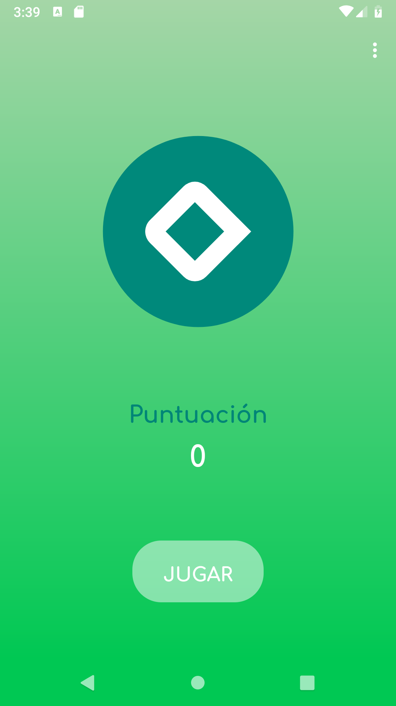
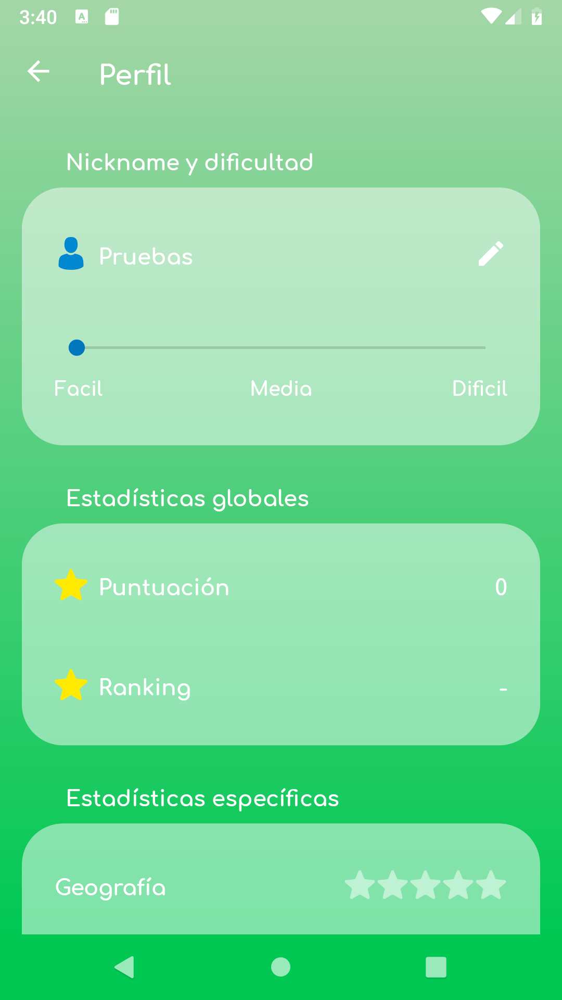
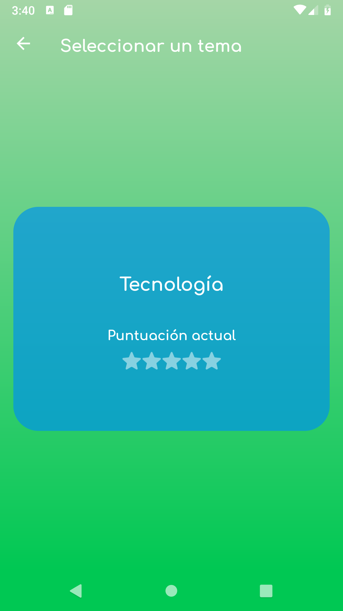
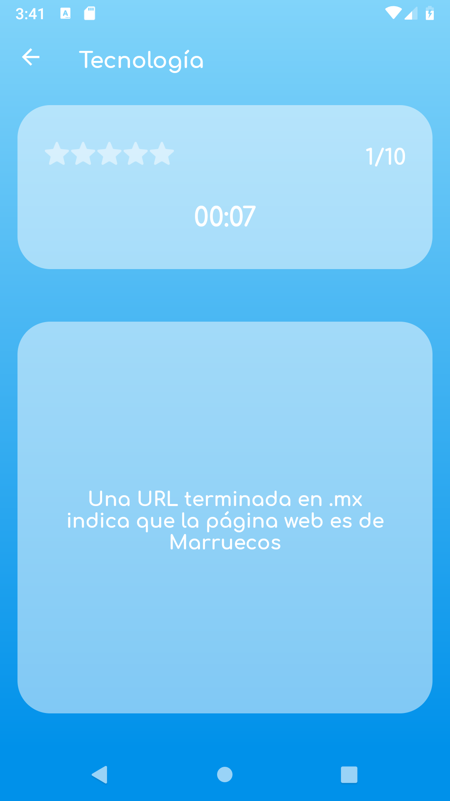
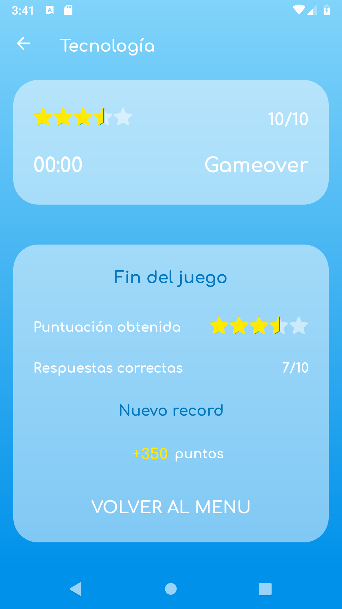
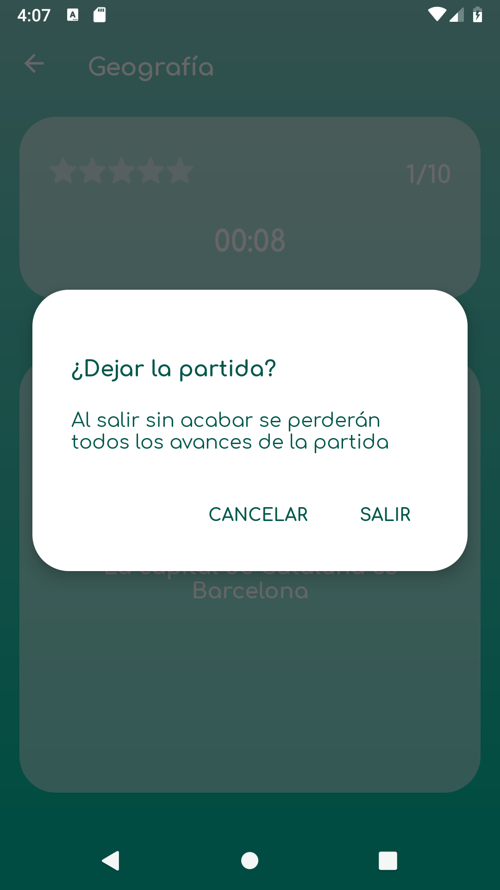

<h1>SharedPrefences game demo app</h1>
<h2>Android (Kotlin)</h2>
<b>Main tools</b>
<ul>
<li>SharedPreferences</li>
<li>Firebase</li>
<li>Gesture Detector</li>
</ul>

<h1>Description</h1>

The idea behind this demo was to develop an app that has both an external and local databases. I know that Firebase in its own can make something similar to that, but I will upgrade on a future app

The app gets the data from Firebase which are stored JSON format in the Shared Preferences of the App. It could be better to store it using other types of storage like SQLITE db or external files, but I've decided to keep it simple for this app

The app use the data directly from the shared preferences and not from Firebase.

Apart from the database part, the idea of the demo app was to create a Quiz game with custom gesture interaction

The design part was a small challange on its own because I wanted to customize a lot of default Android assets, getting away from Material design this time. I have to admit that the final product looks a little bit too greenish

Academic demo app, this app is not completely debugged, it's just a demo. It could contain not extracted text strings and not properly indented code

<h1>Screenshots</h1>

  
  
  

  
  
  

<h1>Demo *</h1>

*A higher quality video opens on YouTube when clicked

  
  

 

  
  

 

  
   

