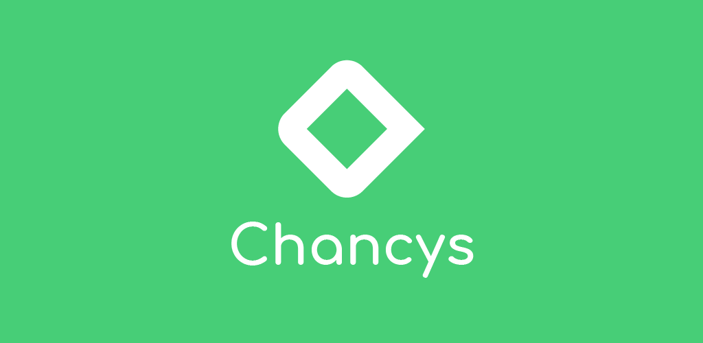
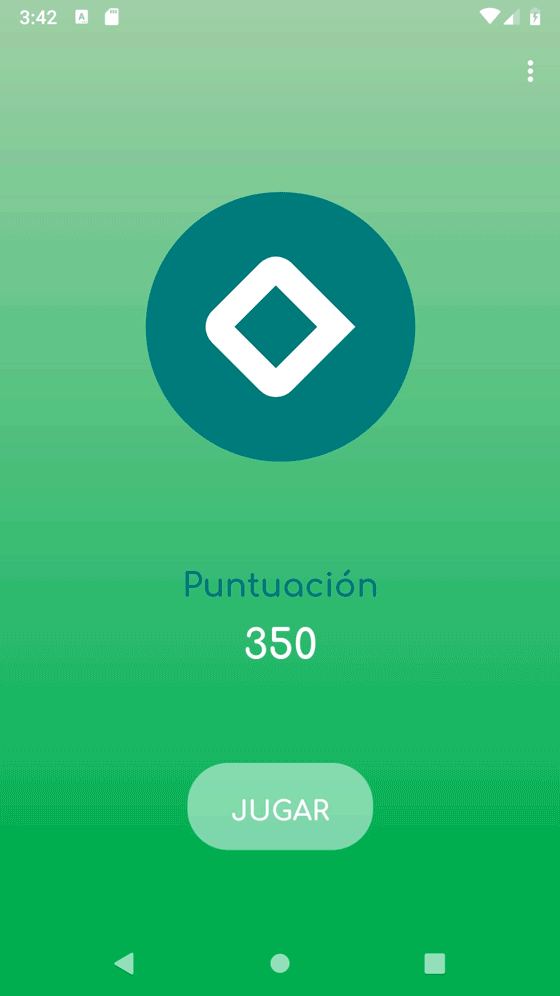
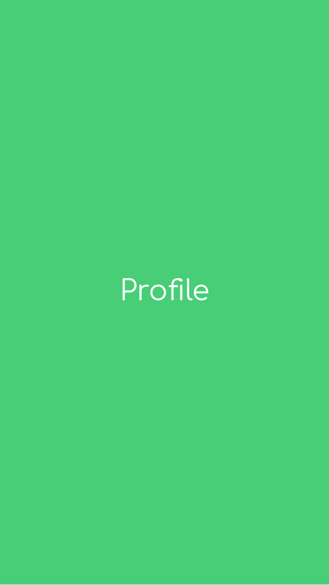
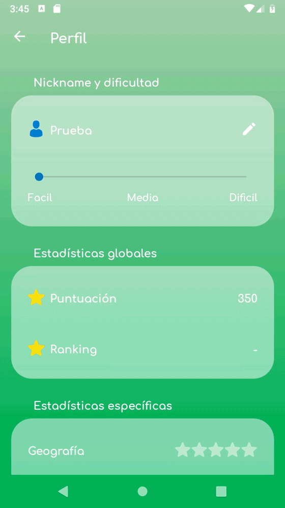
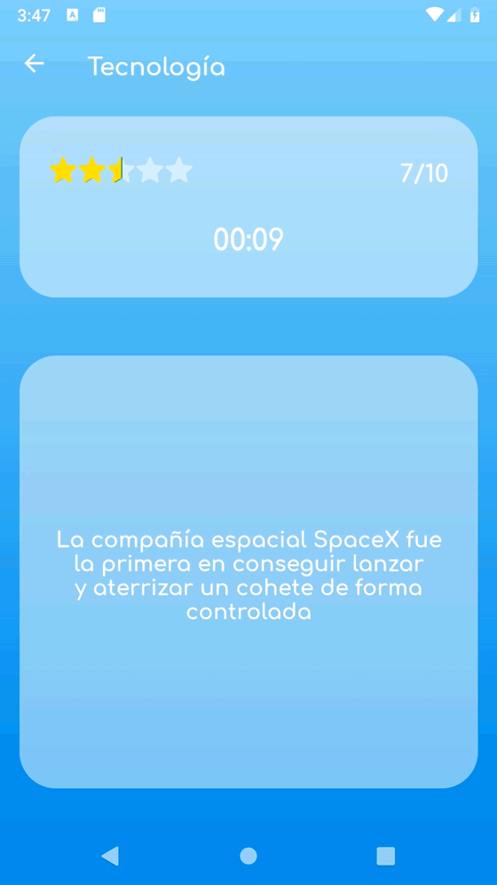
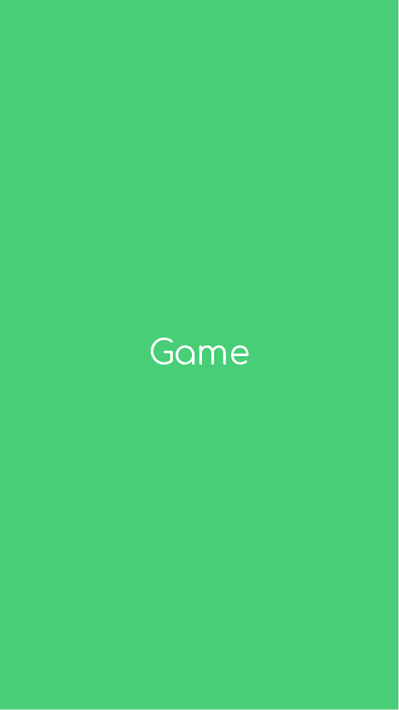

<h1>SharedPrefences game demo app</h1>
<h2>Android (Kotlin)</h2>
<b>Main tools</b>
<ul>
<li>SharedPreferences</li>
<li>Firebase realtime database</li>
<li>Gesture Detector</li>
</ul>

<h1>Description</h1>

The idea behind this demo was to develop an app that has both an external and local databases. I know that Firebase on its own can make something similar to that. The fully Firebase integration will be done on a future upgrade.

The data get by the app from Firebase is stored JSON format in the Shared Preferences of the App. It could be better to store it using other types of storage like SQLITE db or external files, but I've decided to keep it simple for this app

The app use the data directly from the shared preferences and not from Firebase.

Apart from the database part, the idea of the demo app was to create a Quiz game with custom gesture interaction

The design part was a small challange on its own because I wanted to customize a lot of default Android assets, getting away from Material design this time. I have to admit that the final product looks a little bit too greenish

Academic demo app, this app is not completely debugged, it's just a demo. It could contain not extracted text strings and not properly indented code

<h1>Screenshots</h1>

  
  
  

  
  
  

<h1>Demo in Google Play</h1>

<h1>Video Demo *</h1>

*A higher quality and longer video opens on YouTube when clicked

  
  

 

  
  

 

  
   

<h1>License</h1>

This repo acts like a portfolio and the app contained here <b>can't hold liability neither place warranty</b>. Furthermore, the final porpouse of this app is not decided yet, so in order to avoid problems in the future this repo has a <b>NonCommercial</b> CC-BY-NC license

 This work is licensed under a <a rel="license" href="http://creativecommons.org/licenses/by-nc-nd/4.0/">Creative Commons Attribution-NonCommercial-NoDerivatives 4.0 International License</a>.
